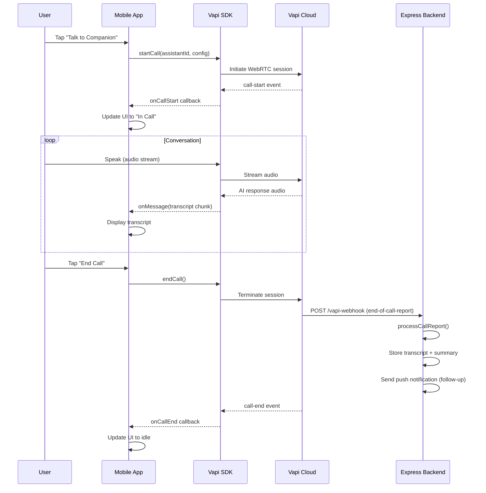
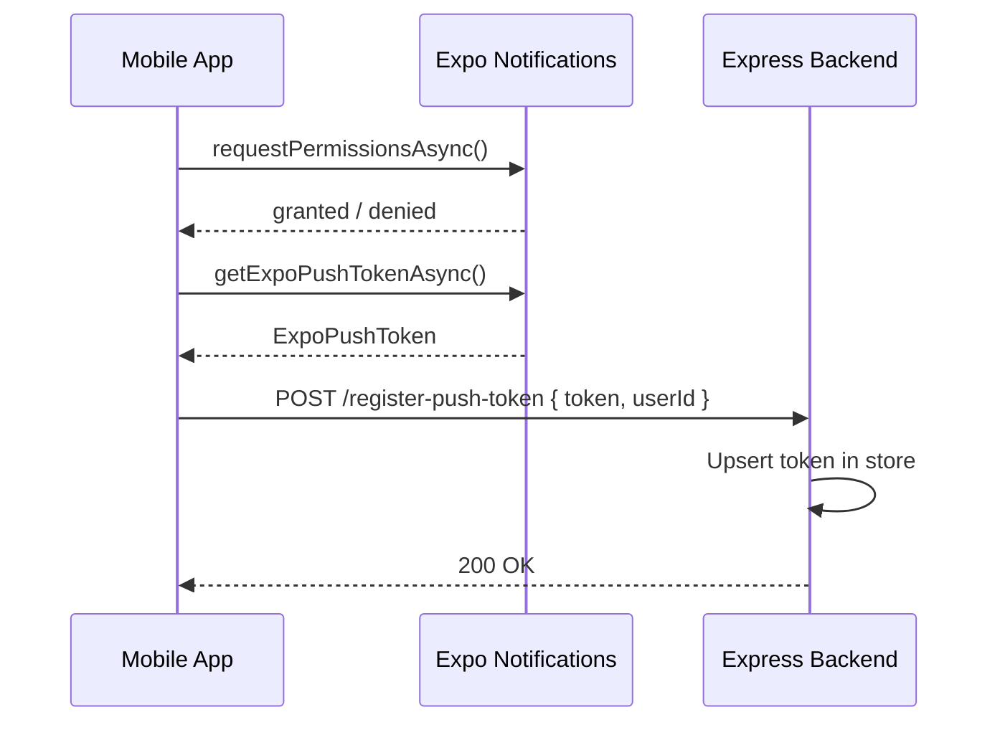

# Design Document: AI Companion App

## Overview

A React Native (Expo) mobile app that provides users with an AI companion they can talk to via voice, powered by Vapi. The app integrates Expo Push Notifications to re-engage users and uses an Express.js backend as the bridge between the mobile client and Vapi's webhook events, storing conversation transcripts and summaries.

The system is composed of three layers: the mobile app (React Native/Expo), the backend server (Express.js), and the Vapi voice AI platform. The mobile app initiates and manages voice calls via the Vapi React Native SDK, while the backend receives webhook events from Vapi to persist transcripts and trigger push notifications.

## Architecture

```mermaid
graph TD
    subgraph Mobile["Mobile App (React Native / Expo)"]
        UI[Companion Screen]
        VapiRN[Vapi RN Client]
        NotifHandler[Notification Handler]
        PushToken[Push Token Manager]
    end

    subgraph Backend["Backend (Express.js :3001)"]
        WebhookHandler[/vapi-webhook]
        NotifService[Push Notification Service]
        ConvoStore[Conversation Store]
        TokenStore[Push Token Store]
        RegEndpoint[/register-push-token]
    end

    subgraph Vapi["Vapi Platform"]
        VapiCloud[Vapi Voice AI]
        Assistant[AI Companion Assistant]
    end

    subgraph Push["Push Infrastructure"]
        ExpoPN[Expo Push Notifications]
        APNS[APNs]
        FCM[FCM]
    end

    UI --> VapiRN
    VapiRN <-->|WebRTC / SDK| VapiCloud
    VapiCloud --> Assistant
    VapiCloud -->|Webhook events| WebhookHandler
    WebhookHandler --> ConvoStore
    WebhookHandler --> NotifService
    NotifService --> ExpoPN
    ExpoPN --> APNS
    ExpoPN --> FCM
    APNS --> NotifHandler
    FCM --> NotifHandler
    PushToken -->|POST /register-push-token| TokenStore
    UI --> PushToken
```

## Sequence Diagrams

### Voice Call Flow



### Push Notification Registration Flow



## Components and Interfaces

### CompanionScreen

**Purpose**: Main UI screen where the user interacts with the AI companion.

**Interface**:
```typescript
interface CompanionScreenProps {
  userId: string
}

type CallState = 'idle' | 'connecting' | 'in-call' | 'ending'
```

**Responsibilities**:
- Render call state UI (idle, connecting, in-call)
- Trigger `startCall` / `endCall` on user interaction
- Display live transcript chunks during a call
- Request microphone permissions before first call

---

### VapiService

**Purpose**: Wraps the `@vapi-ai/react-native` SDK, adapting the existing `vapiClient.js` pattern for React Native.

**Interface**:
```typescript
interface VapiServiceConfig {
  publicKey: string
  assistantId: string
  assistantOverrides?: AssistantOverrides
}

interface VapiService {
  startCall(config: VapiServiceConfig): Promise<void>
  endCall(): void
  onCallStart(cb: () => void): void
  onCallEnd(cb: () => void): void
  onMessage(cb: (msg: VapiMessage) => void): void
  onError(cb: (err: Error) => void): void
}
```

**Responsibilities**:
- Initialize Vapi with public key
- Start/stop calls with assistant configuration
- Emit typed events to the UI layer
- Handle SDK errors gracefully

---

### NotificationService

**Purpose**: Manages Expo Push Notification registration and local notification handling.

**Interface**:
```typescript
interface NotificationService {
  registerForPushNotifications(): Promise<string | null>
  syncTokenWithServer(token: string, userId: string): Promise<void>
  setupNotificationHandlers(
    onReceive: (notification: Notification) => void,
    onResponse: (response: NotificationResponse) => void
  ): () => void  // returns cleanup function
}
```

**Responsibilities**:
- Request notification permissions
- Retrieve Expo push token
- POST token to backend `/register-push-token`
- Set up foreground and response listeners

---

### Express Backend Endpoints

**Purpose**: Bridge between Vapi webhooks and the mobile app ecosystem.

**Interface**:
```typescript
// POST /vapi-webhook
interface VapiWebhookBody {
  message: VapiWebhookMessage
}

// POST /register-push-token
interface RegisterTokenBody {
  token: string   // Expo push token
  userId: string
}

// GET /conversations/:userId
interface ConversationSummary {
  callId: string
  summary: string
  transcript: string
  createdAt: string
}
```

**Responsibilities**:
- Handle `call-started`, `transcript`, `end-of-call-report`, `function-call` webhook events
- Store call transcripts and summaries
- Send follow-up push notifications after call ends
- Register and persist Expo push tokens per user

---

## Data Models

### Conversation

```typescript
interface Conversation {
  callId: string
  userId: string
  transcript: string
  summary: string
  recordingUrl?: string
  createdAt: Date
  durationSeconds?: number
}
```

**Validation Rules**:
- `callId` must be non-empty string
- `transcript` may be empty string (short calls)
- `createdAt` defaults to `new Date()` at insert time

---

### PushTokenRecord

```typescript
interface PushTokenRecord {
  userId: string
  expoPushToken: string
  platform: 'ios' | 'android'
  updatedAt: Date
}
```

**Validation Rules**:
- `expoPushToken` must match `ExponentPushToken[...]` format
- One token per userId (upsert on conflict)

---

### VapiMessage (client-side)

```typescript
type VapiMessageRole = 'user' | 'assistant' | 'system'

interface VapiMessage {
  type: 'transcript' | 'function-call' | 'hang' | 'speech-update'
  role?: VapiMessageRole
  transcript?: string
  transcriptType?: 'partial' | 'final'
}
```

---

## Algorithmic Pseudocode

### startCall Algorithm

```typescript
async function startCall(config: VapiServiceConfig): Promise<void>
```

**Preconditions:**
- Microphone permission is granted
- `config.publicKey` and `config.assistantId` are non-empty
- No call is currently active (`callState === 'idle'`)

**Postconditions:**
- Vapi SDK session is established
- `callState` transitions to `'connecting'` then `'in-call'`
- `onCallStart` callback fires on success

**Algorithm:**
```typescript
ALGORITHM startCall(config)
  ASSERT microphonePermission === 'granted'
  ASSERT callState === 'idle'

  SET callState ← 'connecting'

  TRY
    await vapi.start(config.assistantId, config.assistantOverrides)
    // onCallStart event fires asynchronously from SDK
  CATCH error
    SET callState ← 'idle'
    EMIT onError(error)
  END TRY
END ALGORITHM
```

---

### processCallReport Algorithm

```typescript
async function processCallReport(report: CallReport): Promise<void>
```

**Preconditions:**
- `report.callId` is a valid non-empty string
- `report.transcript` and `report.summary` are strings (may be empty)

**Postconditions:**
- Conversation record is persisted to store
- If a push token exists for the associated user, a follow-up notification is sent
- No exception is thrown to the webhook handler (errors are caught internally)

**Algorithm:**
```typescript
ALGORITHM processCallReport(report)
  ASSERT report.callId is non-empty

  conversation ← {
    callId: report.callId,
    transcript: report.transcript,
    summary: report.summary,
    createdAt: now()
  }

  await conversationStore.save(conversation)

  userId ← await resolveUserIdFromCallId(report.callId)

  IF userId is not null THEN
    tokenRecord ← await pushTokenStore.findByUserId(userId)

    IF tokenRecord is not null THEN
      await sendPushNotification(tokenRecord.expoPushToken, {
        title: "Your companion misses you",
        body: "Tap to see a summary of your last conversation"
      })
    END IF
  END IF
END ALGORITHM
```

**Loop Invariants:** N/A (no loops)

---

### registerForPushNotifications Algorithm

```typescript
async function registerForPushNotifications(): Promise<string | null>
```

**Preconditions:**
- Running on a physical device (Expo push tokens not available on simulator)
- App has been granted notification permissions or permission request is pending

**Postconditions:**
- Returns a valid Expo push token string on success
- Returns `null` if permissions denied or device is a simulator
- No side effects beyond permission request

**Algorithm:**
```typescript
ALGORITHM registerForPushNotifications()
  IF NOT isPhysicalDevice() THEN
    LOG "Push notifications not available on simulator"
    RETURN null
  END IF

  permission ← await Notifications.requestPermissionsAsync()

  IF permission.status !== 'granted' THEN
    RETURN null
  END IF

  tokenData ← await Notifications.getExpoPushTokenAsync({
    projectId: Constants.expoConfig.extra.eas.projectId
  })

  RETURN tokenData.data  // "ExponentPushToken[...]"
END ALGORITHM
```

---

## Key Functions with Formal Specifications

### `syncTokenWithServer(token, userId)`

```typescript
async function syncTokenWithServer(token: string, userId: string): Promise<void>
```

**Preconditions:**
- `token` matches `/^ExponentPushToken\[.+\]$/`
- `userId` is non-empty string
- Network is reachable

**Postconditions:**
- Server has an up-to-date token record for `userId`
- On network failure, error is logged but not re-thrown (best-effort)

---

### `sendPushNotification(token, payload)`

```typescript
async function sendPushNotification(
  token: string,
  payload: { title: string; body: string; data?: Record<string, unknown> }
): Promise<void>
```

**Preconditions:**
- `token` is a valid Expo push token
- `payload.title` and `payload.body` are non-empty strings

**Postconditions:**
- Notification is queued with Expo Push API
- HTTP 200 response from `https://exp.host/--/api/v2/push/send`
- On failure, error is logged; no retry in v1

---

## Example Usage

### Starting a call from the mobile app

```typescript
// CompanionScreen.tsx
const handleTalkPress = async () => {
  const { status } = await Audio.requestPermissionsAsync()
  if (status !== 'granted') return

  await vapiService.startCall({
    publicKey: process.env.EXPO_PUBLIC_VAPI_KEY!,
    assistantId: process.env.EXPO_PUBLIC_ASSISTANT_ID!,
    assistantOverrides: {
      firstMessage: "Hey, I've been thinking about you. How are you feeling today?"
    }
  })
}
```

### Registering push token on app launch

```typescript
// App.tsx
useEffect(() => {
  const init = async () => {
    const token = await notificationService.registerForPushNotifications()
    if (token && userId) {
      await notificationService.syncTokenWithServer(token, userId)
    }
  }
  init()
}, [userId])
```

### Backend sending a post-call notification

```typescript
// server.js — inside processCallReport
const tokenRecord = await pushTokenStore.findByUserId(userId)
if (tokenRecord) {
  await fetch('https://exp.host/--/api/v2/push/send', {
    method: 'POST',
    headers: { 'Content-Type': 'application/json' },
    body: JSON.stringify({
      to: tokenRecord.expoPushToken,
      title: 'Your companion misses you',
      body: summary ?? 'Tap to continue your conversation'
    })
  })
}
```

---

## Correctness Properties

*A property is a characteristic or behavior that should hold true across all valid executions of a system — essentially, a formal statement about what the system should do. Properties serve as the bridge between human-readable specifications and machine-verifiable correctness guarantees.*

### Property 1: CallState machine transitions are deterministic

*For any* VapiService instance, the sequence of CallState values observed during a successful call must always follow the path `idle → connecting → in-call → ending → idle`, with no skipped or reversed transitions.

**Validates: Requirements 1.2, 1.3, 1.4**

---

### Property 2: startCall is rejected when not idle

*For any* VapiService instance where CallState is not `idle`, invoking `startCall` must leave CallState unchanged and must not invoke `vapi.start()`.

**Validates: Requirements 1.6**

---

### Property 3: startCall error resets state

*For any* error thrown by `vapi.start()`, the VapiService must reset CallState to `idle` and invoke all registered `onError` callbacks with the error.

**Validates: Requirements 1.5**

---

### Property 4: Webhook handler always responds HTTP 200

*For any* valid or unrecognized Vapi webhook payload (including cases where `processCallReport` throws internally), the WebhookHandler must respond with HTTP 200 and must not leave the request hanging.

**Validates: Requirements 4.1, 4.2, 4.5, 4.6**

---

### Property 5: end-of-call-report triggers conversation persistence

*For any* `end-of-call-report` webhook payload with a non-empty `callId`, `processCallReport` must persist exactly one Conversation record whose `callId`, `transcript`, and `summary` fields match the payload values.

**Validates: Requirements 4.3, 5.1**

---

### Property 6: Conversation list is ordered by createdAt descending

*For any* set of Conversation records stored for a given userId, `GET /conversations/:userId` must return them in descending order of `createdAt` with no records omitted.

**Validates: Requirements 5.4**

---

### Property 7: PushTokenStore upsert maintains one token per userId

*For any* sequence of `POST /register-push-token` requests for the same userId (with valid token format), the PushTokenStore must contain exactly one PushTokenRecord for that userId after all requests complete.

**Validates: Requirements 6.4**

---

### Property 8: Push token format validation

*For any* string that does not match `ExponentPushToken[...]`, the PushTokenStore must reject it. *For any* string that does match, the PushTokenStore must accept it.

**Validates: Requirements 6.7**

---

### Property 9: Push notification sent only when token exists

*For any* completed call report, a push notification is sent to the Expo Push API if and only if a PushTokenRecord exists for the associated userId.

**Validates: Requirements 7.2, 7.3**

---

### Property 10: Push API errors do not propagate

*For any* error response from the Expo Push API, `processCallReport` must catch the error, log it, and return normally without throwing.

**Validates: Requirements 7.4**

---

### Property 11: Transcript chunks accumulate correctly

*For any* sequence of transcript message events emitted by VapiService during a call, the CompanionScreen's displayed transcript must equal the ordered concatenation of all received chunks.

**Validates: Requirements 3.1**

---

### Property 12: New call clears previous transcript

*For any* CompanionScreen state with a non-empty transcript, initiating a new call must result in an empty transcript before the first new chunk arrives.

**Validates: Requirements 3.2**

---

### Property 13: CompanionScreen UI reflects CallState

*For any* CallState value, the CompanionScreen must render exactly the controls and indicators specified for that state: idle shows an enabled start control; connecting shows a loading indicator and disabled start control; in-call shows an enabled end control and transcript area; ending shows all controls disabled.

**Validates: Requirements 9.1, 9.2, 9.3, 9.4**

---

### Property 14: Notification callbacks are routed correctly

*For any* foreground notification received, the `onReceive` callback must be invoked. *For any* notification response (tap), the `onResponse` callback must be invoked. After the cleanup function is called, neither callback must be invoked for subsequent events.

**Validates: Requirements 8.1, 8.2, 8.3**

---

### Property 15: Webhook secret gate blocks unauthorized requests

*For any* incoming request to `/vapi-webhook` that is missing or has an incorrect `x-vapi-secret` header, the WebhookHandler must reject the request before invoking any processing logic.

**Validates: Requirements 4.7**

---

## Error Handling

### Microphone Permission Denied

**Condition**: User denies microphone access on first call attempt
**Response**: Show an in-app alert explaining why the permission is needed; do not attempt to start the call
**Recovery**: Deep-link user to app settings via `Linking.openSettings()`

### Vapi SDK Connection Failure

**Condition**: `vapi.start()` throws or times out
**Response**: Reset `callState` to `'idle'`, display error toast
**Recovery**: User can retry; exponential backoff not required in v1

### Webhook Processing Error

**Condition**: `processCallReport` throws (e.g., DB write fails)
**Response**: Log error, still respond HTTP 200 to Vapi (prevent retries flooding the server)
**Recovery**: Implement idempotent retry queue in v2

### Push Notification Delivery Failure

**Condition**: Expo Push API returns error ticket
**Response**: Log the error ticket; do not crash the webhook handler
**Recovery**: Check Expo receipts endpoint in a background job (v2)

### Simulator / No Physical Device

**Condition**: `registerForPushNotifications` called on iOS Simulator
**Response**: Return `null`, skip token sync
**Recovery**: No action needed; feature degrades gracefully

---

## Testing Strategy

### Unit Testing Approach

Test each service in isolation with mocked dependencies:
- `VapiService`: mock the `@vapi-ai/react-native` SDK, assert state transitions
- `NotificationService`: mock `expo-notifications`, assert token format validation
- `processCallReport`: mock `conversationStore` and `pushTokenStore`, assert correct calls

### Property-Based Testing Approach

**Property Test Library**: fast-check

- For any `VapiWebhookMessage` with `type === 'end-of-call-report'`, `processCallReport` always persists exactly one record
- For any valid Expo push token string, `syncTokenWithServer` never throws
- For any `callState !== 'idle'`, `startCall` always rejects without mutating external state

### Integration Testing Approach

- Spin up the Express server against a test DB, POST mock Vapi webhook payloads, assert DB records and notification calls
- Use `expo-notifications` test utilities to verify token registration flow end-to-end

---

## Performance Considerations

- Voice calls use WebRTC via the Vapi SDK — no additional audio streaming infrastructure needed
- Push notifications are fire-and-forget; use Expo's batched push API for scale
- Conversation transcripts can be large; consider pagination on `GET /conversations/:userId`
- Token store lookups should be indexed by `userId` for O(1) retrieval

---

## Security Considerations

- Vapi public key is safe to embed in the mobile app; keep the Vapi private key server-side only
- Validate webhook authenticity using Vapi's webhook secret header (`x-vapi-secret`) before processing
- Expo push tokens are user-specific PII; store them encrypted at rest in production
- Use HTTPS for all backend endpoints; never send tokens over plain HTTP
- Sanitize `summary` and `transcript` fields before storing to prevent injection

---

## Dependencies

| Package | Purpose |
|---|---|
| `@vapi-ai/react-native` | Vapi voice SDK for React Native (replaces `@vapi-ai/web`) |
| `expo-notifications` | Push notification registration and handling |
| `expo-av` | Microphone permission and audio session management |
| `expo-constants` | Access `expoConfig.extra.eas.projectId` for push token |
| `expo-device` | Detect physical device vs simulator |
| `express` | Backend HTTP server (existing) |
| `dotenv` | Environment variable management (existing) |
